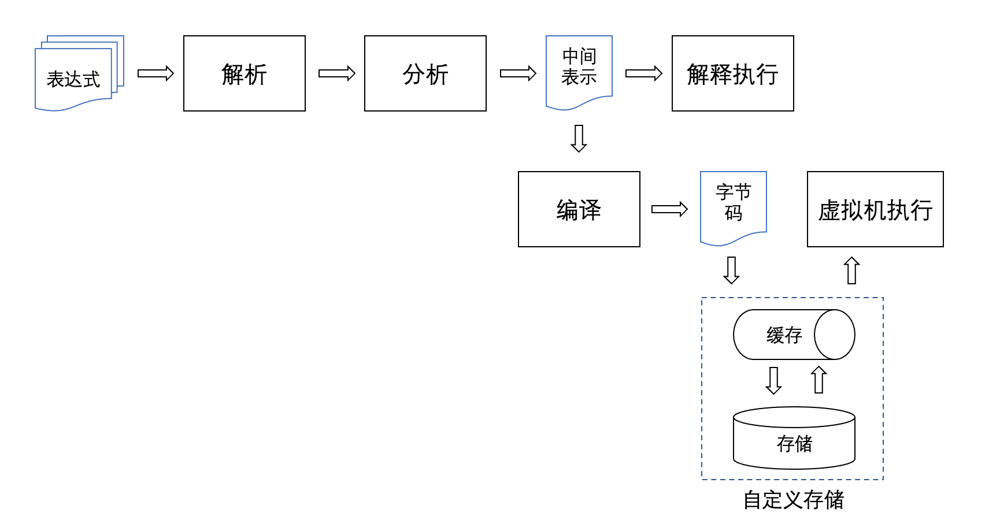

# Loxpression
# 一、背景介绍
Loxpression是一款面向Java平台的高性能、轻量级表达式计算引擎，旨在提高用户系统在不同业务场景下的扩展能力。
# 二、用法说明
## 求值模式
支持+、-、*、/、**【指数运算】、<、>、<=、>=、==、!=、%、&&、||、!、等操作符。支持Excel风格的if(cond, thenBranch, elseBranch)条件函数。
```java
Environment env = new DefaultEnvironment();  
env.put("a", 1);
env.put("b", 2);
env.put("c", 3);
LoxRunner runner = new LoxRunner();
Object r = runner.execute("a + b * c - 100 / 5 ** 2 ** 1", env);
System.out.println(r); // 3.0
		
r = runner.execute("a + b * c >= 6", env);
System.out.println(r); // true
```
## 运算模式
支持表达式变量赋值运算，多个表达式批量进行运算时，支持根据表达式的依赖关系先进行排序，再运算。并且会对运算表达式之间是否有循环依赖进行检测。
```java
List<String> srcs = new ArrayList<>();
srcs.add("x = a + b * c");
srcs.add("a = m + n");
srcs.add("b = a * 2");
srcs.add("c = n + w + b");

LoxRunner runner = new LoxRunner();
Environment env = new DefaultEnvironment();
env.put("m", 2);
env.put("n", 4);
env.put("w", 6);
runner.execute(srcs, env);

System.out.println(env.get("x")); // 126
System.out.println(env.get("a")); // 6
System.out.println(env.get("b")); // 12
System.out.println(env.get("c")); // 10
```
##  定义环境
表达式求值时，对于遇到的变量，求值器会从环境对象Environment中取值，赋值表达式则会把求值的结果写回到Environment中，因此对于表达式中用到的变量，具体含义需要在Environment中进行定义：
```java
Environment env = new DefaultEnvironment();  
env.put("a", 1);
env.put("b", 2);
env.put("c", 3);
LoxRunner runner = new LoxRunner();
Object r = runner.execute("a + b * c ", env);
System.out.println(r); // 7
```
系统提供的默认环境对象为DefaultEnvironment，在执行表达式前，对于表达式中需要读取值的变量，都需要在DefaultEnvironment对象中有值。有时候需要执行的表达式数量较多，在对表达式做解析之前，业务层无法高效的把所有变量值都提前准备好，或者表达式中的变量和实际数据之间是间接的关联，这时候便可以根据需要自定义环境对象，只需继承Environment抽象类即可。参照示例:[FormEnvironment.java](https://github.com/SimonFamily/Loxpression/blob/master/src/test/java/com/loxpression/env/form/FormEnvironment.java)，以及单元测试:[FormEnvTest.java](https://github.com/SimonFamily/Loxpression/blob/master/src/test/java/com/loxpression/env/form/FormEnvTest.java)
## 编译运行
Loxpression提供两种执行表达式的方式，一是直接执行表达式字符串，比如上文所举例子，适合表达式数量较少的情况。二是先把表达式编译为字节码(Chunk)，业务系统缓存或者存储字节码对象，后续需要执行时直接运行字节码。
- 编译表达式：
```java
LoxRunner runner = new LoxRunner();
Chunk chunk = runner.compileSrc(srcs);
```
- 运行字节码：
```java
LoxRunner runner = new LoxRunner();
Environment env = getEnv();
runner.runChunk(chunk, env);
```
Chunk对象只由字节数组构成，序列化、反序列化性能极高，适合集群环境使用redis等缓存服务做缓存的场景。

# 三、实现方式


字符串形式的表达式在解析器中通过词法分析、语法分析过程得到语法树，然后在分析环节，Loxpression会提取出所有表达式的变量信息，并根据变量间的依赖关系对所有公式做排序，得到可顺序执行的中间表示结构(ExprInfo)。

接下来对表达式的执行，最简单的就是直接解释执行表达式语法树，这种方式适合公式表达式数量比较少的情况，每次都从头解析、分析、执行，性能上也不会有太大问题。但如果每次需要执行的表达式数量都有成千上万条，那么每执行一次都从0开始做解析，就会造成资源的浪费。如果系统是单机环境，那么可以把中间表示结构缓存在内存中。但如果系统是集群部署，缓存是类似redis的独立服务，则中间结构所占的空间就太大了，读写缓存时序列化、反序列化、网络传输会占用很多时间。

针对这种情况，Loxpression提供了字节码格式的执行方式。业务系统在配置好表达式以后，可以先将表达式编译为字节码(Chunk)，然后将字节码放入缓存或者数据库、文件等存储服务中。最后需要执行的时候，从存储/缓存服务中读取出字节码再运行。
## 3.1 解析
### 词法分析

### 语法分析

## 3.2 分析

## 3.3 解释执行

## 3.4 编译

## 3.5 虚拟机运行
